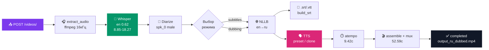

<div align="center">

# 🎬 AutoDub / AutoSub API

### Автоперевод и автоозвучка видео + субтитры

<p>
  
  
  
  
  
</p>

**Загружаешь видео → получаешь `en` → выбираешь `ru` → забираешь `.srt` и видео с дубляжом**

`Whisper` → `pyannote` → `NLLB` → `edge-tts / CosyVoice` → `atempo` → `mux`

[📊 Презентация](presentation.html) • [📋 План](PLAN.md) • [📝 ТЗ](TZ_AutoDub_API.md) • `GET /health/` `GET /languages/` `GET /voices/`

</div>

---

## ✨ Что умеет

> **Бекенд готов для фронта (Этапы 1-3). Этап 4 — пожелание.**

| Возможность | Как работает | Где в коде |
|---|---|---|
| **Авто-язык** | `faster-whisper base` → `detected_language` + `confidence` | `core/tasks.py:94` |
| **Субтитры** | `.srt` + `.vtt` с таймкодами Whisper | `core/subtitles.py` |
| **Перевод** | `NLLB-200` (локально) / `mock` / `google` | `core/translation.py:26` |
| **Диаризация** | `pyannote/speaker-diarization-3.1` → `speaker_id` | `core/diarization.py:17` |
| **Пол голоса** | `librosa piptrack` F0 → `male/female` | `core/gender.py:8` |
| **Пресеты** | 14 голосов `ru/en/fr/de/es/zh/kk` × `m/f` | `core/voices.py:26` |
| **TTS реал** | `edge-tts` `Dmitry/Svetlana` 24кГц | `core/tts.py:22` |
| **Клон голоса** | `CosyVoice3` на Colab T4 + туннель → `zero_shot` | `core/cosyvoice_client.py:81` |
| **Синхрон** | `ffmpeg atempo` 0.5-2.0 цепочка | `core/audio.py:36` |
| **Сборка** | `assemble_dubbed_audio` + `mux -c:v copy` | `core/mux.py:11` |



---

## 🚀 Быстрый старт — 3 команды

```powershell
git clone https://github.com/<твой>/Service.git
cd Service
copy .env.example .env   # заполни SECRET_KEY и пароли
```

> **Дальше — разворачиваем по шагам ниже (кликни чтобы развернуть).**

---

<details>
<summary><b>1️⃣ Клонировать проект</b> — как скачать</summary>

```powershell
# HTTPS
git clone https://github.com/Omurbek000/Service.git
cd Service

# или SSH
git clone git@github.com:Omurbek000/Service.git
cd Service

# проверь что ты на main
git status
git log --oneline -3
```

Файл `presentation.html` — живая преза (открой `http://localhost:8001/presentation.html`).

</details>

<details>
<summary><b>2️⃣ Установить зависимости</b> — Python 3.14 + venv</summary>

```powershell
# создай venv (если нет)
py -3.14 -m venv .venv
.venv\Scripts\activate

# поставь зависимости (всё для локальной разработки, без GPU)
.venv\Scripts\python.exe -m pip install --upgrade pip
.venv\Scripts\python.exe -m pip install -r requirements.txt

# что внутри requirements.txt (109 пакетов)
# Django 6.1, DRF 3.18, SimpleJWT, Channels, Celery, Redis,
# faster-whisper, ctranslate2, httpx, soundfile, psycopg[binary],
# + для реала: torch CPU, transformers, sentencepiece, edge-tts, fastapi
```

**Для реала (опционально, тяжело — 3ГБ):**
```powershell
# перевод NLLB
.venv\Scripts\python.exe -m pip install transformers sentencepiece torch --index-url https://download.pytorch.org/whl/cpu
# голос edge-tts (50МБ, реал без GPU)
.venv\Scripts\python.exe -m pip install edge-tts
# CosyVoice — только на Colab/Kaggle, локально не ставь (см. gpu_worker/README.md)
```

Проверка:
```powershell
.venv\Scripts\python.exe -c "import django; print(django.VERSION)"
.venv\Scripts\python.exe manage.py check
```

</details>

<details>
<summary><b>3️⃣ Настроить .env</b> — переменные</summary>

```powershell
copy .env.example .env
notepad .env
```

```ini
SECRET_KEY=сгенерируй_через_python -c "from django.core.management.utils import get_random_secret_key; print(get_random_secret_key())"

# База (порт 5433! 5432 занят локальным Postgres 18)
POSTGRES_DB=autodub
POSTGRES_USER=autodub
POSTGRES_PASSWORD=autodub_db_2026
DB_HOST=localhost
DB_PORT=5433

REDIS_URL=redis://localhost:6379/0
MINIO_ENDPOINT=localhost:9000

FFMPEG_PATH=C:\Users\GG\AppData\Local\Microsoft\WinGet\Packages\Gyan.FFmpeg_Microsoft.Winget.Source_8wekyb3d8bbwe\ffmpeg-9.0-full_build\bin\ffmpeg.exe

# ML
WHISPER_MODEL=base
MOCK_ML=false              # false = реал Whisper, true = заглушка Hello...
TRANSLATE_PROVIDER=nllb    # mock | nllb | google
NLLB_MODEL=facebook/nllb-200-distilled-600M
HF_TOKEN=hf_xxx            # для pyannote, прими лицензии на HF

# CosyVoice GPU-воркер (Colab)
COSYVOICE_URL=https://xxx.trycloudflare.com
COSYVOICE_ENABLED=true
COSYVOICE_SAMPLE_MIN_DURATION=1.5

VIDEO_MAX_SIZE_MB=2048
```

> `MOCK_ML=true` + `TRANSLATE_PROVIDER=mock` — без скачки моделей, всё на заглушках (для тестов 37/37). `MOCK_ML=false` + `nllb` — реал, но 230с/фразу на Celeron.

</details>

<details>
<summary><b>4️⃣ Запустить Docker — PostgreSQL + Redis + MinIO</b></summary>

> **Docker Desktop должен быть запущен вручную** (иконка в трее). CLI не в `PATH` — используй полный путь:

```powershell
# проверь Docker
C:\Users\GG\AppData\Local\Programs\DockerDesktop\resources\bin\docker.exe ps

# подними контейнеры (из папки Service)
C:\Users\GG\AppData\Local\Programs\DockerDesktop\resources\bin\docker.exe compose up -d

# проверь
C:\Users\GG\AppData\Local\Programs\DockerDesktop\resources\bin\docker.exe compose ps
# autodub-postgres  5433->5432
# autodub-redis     6379
# autodub-minio     9000
```

`docker-compose.yml`:
```yaml
services:
  db:    image: postgres:16  ports: ["5433:5432"]
  redis: image: redis:7
  minio: image: minio/minio  ports: ["9000:9000"]
```

Остановить: `docker compose down` • Логи: `docker compose logs -f`

</details>

<details>
<summary><b>5️⃣ Миграции + админка</b></summary>

```powershell
.venv\Scripts\python.exe manage.py migrate
.venv\Scripts\python.exe manage.py createsuperuser  # admin / ...
.venv\Scripts\python.exe manage.py shell -c "from django.contrib.auth.models import User; print(User.objects.count())"
```

Модели: `Video` (UUID, owner, file, duration, detected_language), `Transcript` (segments, speakers), `Job` (mode, target_languages, voice_mode, result_files), `JobLog` (step, status).

Админка: `http://localhost:8000/admin/` → `Video / Transcript / Job / JobLog`

</details>

<details>
<summary><b>6️⃣ Запустить Django + Celery — 2 терминала</b></summary>

```powershell
# Терминал 2 — Django
.venv\Scripts\python.exe manage.py runserver
# http://localhost:8000/health/ → {"status":"ok","database":"ok","redis":"ok","ffmpeg":"ok"}
# http://localhost:8000/admin/

# Терминал 3 — Celery воркер (Windows обязательно -P solo)
.venv\Scripts\celery -A voical worker -Q cpu -P solo -l info
# [tasks] . core.tasks.extract_audio_task
#         . core.tasks.detect_language_task
#         . core.tasks.process_job_task
```

> На Linux/Mac: `celery -A voical worker -Q cpu -l info` (без `-P solo`).

Проверка без Celery (синхронно, для теста):
```powershell
.venv\Scripts\python.exe manage.py test core.tests.test_dubbing_e2e --verbosity=2
# 2 tests OK — полный пайплайн dubbing без БД
```

</details>

<details>
<summary><b>7️⃣ Проверить — загрузить видео</b></summary>

```powershell
# 1. Регистрация
curl -X POST http://localhost:8000/auth/register/ -H "Content-Type: application/json" -d "{\"username\":\"test\",\"password\":\"123456\",\"email\":\"t@t.com\"}"

# 2. Логин
curl -X POST http://localhost:8000/auth/login/ -H "Content-Type: application/json" -d "{\"username\":\"test\",\"password\":\"123456\"}"
# → {"access":"...","refresh":"..."}

# 3. Залить видео (7 МБ из корня)
curl -X POST http://localhost:8000/videos/ -H "Authorization: Bearer <access>" -F file=@./*My_Love*.mp4
# → {"id":"07dd...","status":"uploading"}

# 4. Ждём 6с → проверяем язык
curl http://localhost:8000/videos/<id>/ -H "Authorization: Bearer <access>"
# → {"detected_language":"en","confidence":0.62}

# 5. Создать задачу дубляжа
curl -X POST http://localhost:8000/jobs/ -H "Authorization: Bearer <access>" -H "Content-Type: application/json" -d "{\"video\":\"<id>\",\"mode\":\"dubbing\",\"target_languages\":[\"ru\"]}"
# → {"id":"...","status":"queued"}

# 6. Поллить статус или WS
curl http://localhost:8000/jobs/<job_id>/ -H "Authorization: Bearer <access>"
# → {"progress_percent":62,"current_step":"tts","voice_mode":"clone"}
# WS: ws://localhost:8000/ws/jobs/<id>/?token=<access> → {"type":"progress",...} → {"type":"completed","result_files":[...]}

# 7. Скачать
curl -O http://localhost:8000/jobs/<id>/subtitles/?lang=ru&fmt=srt -H "Authorization: Bearer <access>"
# output_ru.srt 124 bytes, output_ru_dubbed.mp4 6.6МБ в корне (демо)
```

В корне уже лежит демо: `output_ru.srt` + `output_ru_dubbed.mp4` (52.59с, Whisper en 0.62 real).

</details>

<details>
<summary><b>8️⃣ Тесты — 37 тестов без БД</b></summary>

```powershell
# все
.venv\Scripts\python.exe manage.py test core.tests --verbosity=2
# 37 tests OK (14.5s)

# по модулям
.venv\Scripts\python.exe manage.py test core.tests.test_audio --verbosity=2          # 8 atempo
.venv\Scripts\python.exe manage.py test core.tests.test_mux --verbosity=2            # 3 assemble/mux
.venv\Scripts\python.exe manage.py test core.tests.test_dubbing_e2e -v2              # 2 full dubbing
.venv\Scripts\python.exe manage.py test core.tests.test_cosyvoice -v2                # 13 health/clone/cache
.venv\Scripts\python.exe manage.py test core.tests.test_voice_priority -v2          # 10 choose/clone
```

`SimpleTestCase` — без Postgres, реальный `ffmpeg` (проверяет `sine 440Hz` → `atempo`).

</details>

<details>
<summary><b>9️⃣ GPU-воркер CosyVoice3 — Colab/Kaggle T4</b></summary>

Локально Celeron не тянет CosyVoice → GPU в облаке + туннель.

**Локально (mock, без GPU):**
```powershell
.venv\Scripts\python.exe -m uvicorn gpu_worker.server:app --host 0.0.0.0 --port 50000
curl http://localhost:50000/health  # {"status":"ok","mock":true}
curl -X POST http://localhost:50000/inference_zero_shot -F tts_text="Привет" -F prompt_text="hello" -F prompt_wav=@media/audio/test.wav --output out.wav
```

**Colab/Kaggle (реал):** см. `gpu_worker/README.md` + `gpu_worker/colab_setup.py`
```python
# Colab ячейки (T4)
!git clone https://github.com/FunAudioLLM/CosyVoice.git
%cd CosyVoice && pip install -r requirements.txt
!cp /content/Service/gpu_worker/server.py ./runtime/python/fastapi/server.py
!nohup python runtime/python/fastapi/server.py --port 50000 --model_dir FunAudioLLM/Fun-CosyVoice3-0.5B &

# туннель cloudflared (без регистрации)
!wget -q https://github.com/cloudflare/cloudflared/releases/latest/download/cloudflared-linux-amd64 -O /tmp/cloudflared && chmod +x /tmp/cloudflared
!nohup /tmp/cloudflared tunnel --url http://localhost:50000 > /tmp/tunnel.log 2>&1 &
!sleep 5 && cat /tmp/tunnel.log | grep -o 'https://.*trycloudflare.com'
# → https://xxx.trycloudflare.com → вставь в Service/.env как COSYVOICE_URL
```

Django: `.env` → `COSYVOICE_URL=https://xxx.trycloudflare.com` + `COSYVOICE_ENABLED=true` → `core/cosyvoice_client.py:31` `health_check` перед каждым `Job`, fallback на `edge-tts` если недоступен.

</details>

<details>
<summary><b>🔧 Переменные .env — шпаргалка</b></summary>

```ini
SECRET_KEY=
POSTGRES_DB=autodub
POSTGRES_USER=autodub
POSTGRES_PASSWORD=
DB_HOST=localhost
DB_PORT=5433
REDIS_URL=redis://localhost:6379/0
FFMPEG_PATH=C:\...\ffmpeg.exe
WHISPER_MODEL=base
MOCK_ML=false
TRANSLATE_PROVIDER=nllb
NLLB_MODEL=facebook/nllb-200-distilled-600M
HF_TOKEN=
DIARIZATION_MODEL=pyannote/speaker-diarization-3.1
COSYVOICE_URL=
COSYVOICE_ENABLED=true
COSYVOICE_TIMEOUT=30
COSYVOICE_SAMPLE_MIN_DURATION=1.5
VIDEO_MAX_SIZE_MB=2048
```

</details>

<details>
<summary><b>🧹 Очистка — как освободить место</b></summary>

См. `CLEANUP.md` (не коммитится) + `WHISPER_NOTES.md`:

```powershell
# NLLB + torch (3ГБ)
.venv\Scripts\python.exe -m pip uninstall -y transformers sentencepiece torch torchaudio
Remove-Item -Recurse -Force "C:\Users\GG\.cache\huggingface\hub\models--facebook--nllb-200-distilled-600M"
Remove-Item -Recurse -Force "C:\Users\GG\.cache\huggingface\hub\models--Systran--faster-whisper-base"  # 141МБ
.venv\Scripts\python.exe -m pip cache purge

# edge-tts
.venv\Scripts\python.exe -m pip uninstall -y edge-tts

# pyannote + librosa
.venv\Scripts\python.exe -m pip uninstall -y pyannote.audio librosa soundfile

# media
Remove-Item -Recurse -Force media\jobs, media\audio -ErrorAction SilentlyContinue

# вернуть заглушки
# .env: MOCK_ML=true, TRANSLATE_PROVIDER=mock
```

</details>

---

## 📚 API — без `/api/v1/` (`voical/urls.py:9`)

| Метод | Endpoint | Описание | Код |
|---|---|---|---|
| POST | `/auth/register/` | регистрация | 201 |
| POST | `/auth/login/` | `access` + `refresh` | 200 |
| POST | `/auth/token/refresh/` | обновить access | 200 |
| POST | `/auth/logout/` | blacklist `refresh` | 205 |
| GET | `/auth/me/` | текущий юзер | 200 |
| POST | `/videos/` | `multipart file` mp4/mov  | 201 → `extract_audio_task` |
| GET | `/videos/` | список `?status=` | 200 |
| GET | `/videos/{id}/` | детали + `detected_language` | 200 |
| DELETE | `/videos/{id}/` | удалить | 204 |
| GET | `/videos/{id}/preview-transcript/` | черновик | 200 |
| POST | `/jobs/` | `{"video","mode":"dubbing","target_languages":["ru"]}` | 201 |
| POST | `/videos/{id}/jobs/` | алиас | 201 |
| GET | `/jobs/` | фильтры `status,mode,video_id` | 200 |
| GET | `/jobs/{id}/` | `progress, voice_mode, result_files` | 200 |
| GET | `/jobs/{id}/result/` | файлы | 200 |
| POST | `/jobs/{id}/cancel/` | отмена | 409 если done |
| POST | `/jobs/{id}/retry/` | перезапуск | 409 если не failed |
| DELETE | `/jobs/{id}/` | удалить + `media/jobs/{id}` | 204 |
| GET | `/jobs/{id}/subtitles/?lang=ru&fmt=srt` | скачать | 200 |
| GET | `/languages/` | 20 языков без auth | 200 |
| GET | `/voices/?lang=ru&gender=male` | 14 пресетов | 200 |
| GET | `/health/` | `database, redis, ffmpeg` | 200/503 |

**WS:** `ws://host/ws/jobs/{id}/?token=<access>` → `{"type":"progress","progress_percent":45}` → `{"type":"completed","result_files":[...]}` / `{"type":"failed"}`

---

## 🗂️ Где что лежит

```
Service/
├── presentation.html          # ← живая преза React в 1 файле (открой http://localhost:8001/presentation.html)
├── output_ru.srt/.vtt/.mp4    # демо продукт (Whisper en 0.62 real)
├── voical/settings.py         # COSYVOICE_URL, MOCK_ML, FFMPEG_PATH
├── voical/urls.py             # без /api/v1/
├── core/
│   ├── tasks.py:94            # extract/detect/process (logger + JobLog)
│   ├── audio.py:36            # atempo цепочка
│   ├── mux.py:11              # assemble + mux -c:v copy
│   ├── tts.py:22              # mock → edge-tts
│   ├── cosyvoice_client.py:31 # health → zero_shot → fallback + кэш
│   ├── separation.py:12       # Demucs mock
│   ├── diarization.py:17      # pyannote mock
│   ├── gender.py:8            # librosa piptrack
│   ├── voices.py:26           # 14 пресетов
│   └── tests/ (37 tests)      # test_audio, test_mux, test_dubbing_e2e, test_cosyvoice, test_voice_priority
├── gpu_worker/
│   ├── server.py:29           # FastAPI /health /inference_zero_shot (mock/real)
│   ├── colab_setup.py         # 1 ячейка для Colab
│   └── README.md              # туннель cloudflared
├── docker-compose.yml         # postgres:16 5433, redis:7, minio
└── requirements.txt (109)     # Django 6.1, DRF, Channels, Celery, faster-whisper, edge-tts
```

**Логи:** `core/tasks.py:189` `logger.info` + `JobLog` (`process_start`, `translate_to_ru`, `tts_ru`, `mux_ru`, `process_done`) → смотри в `admin` или `docker logs`.

---

## 🗓️ Roadmap

- ✅ **Этап 1 (1-10)** — MVP субтитры, `auth`, `videos`, `jobs`, `WS`, `health`
- ✅ **Этап 2 (11-16)** — дубляж preset `time-stretch` + `mux`, релиз `6ddf33b`
- ✅ **Этап 3 (17-22)** — clone `gpu_worker` + `choose_voice_mode` + `edge-tts`/`NLLB` реал + `separation` mock + `presentation.html`, релиз `9090883`
- ⏳ **Этап 4 (пожелание)** — тарифы, `PATCH /jobs/{id}/subtitles/`, presigned upload >2ГБ, кабинеты, email/webhook — позже

<div align="center">

**Сделано с ❤️ на Django • Открой `presentation.html` через `python -m http.server 8001`**

`POSTGRES 5433` • `MOCK_ML=false` • `37/37 tests` • `ffmpeg 9` • `Python 3.14`

</div>
